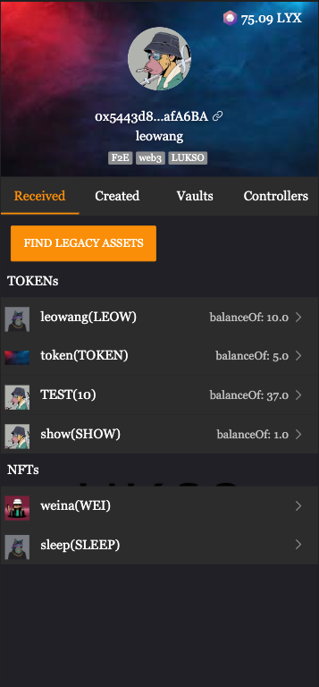
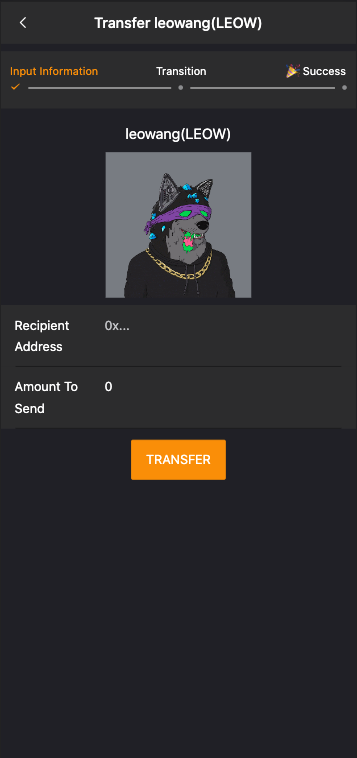
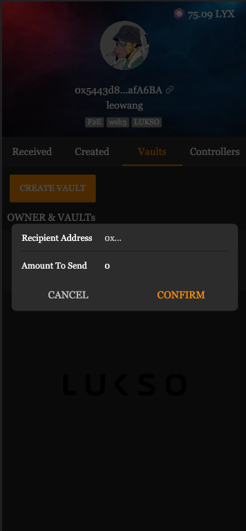
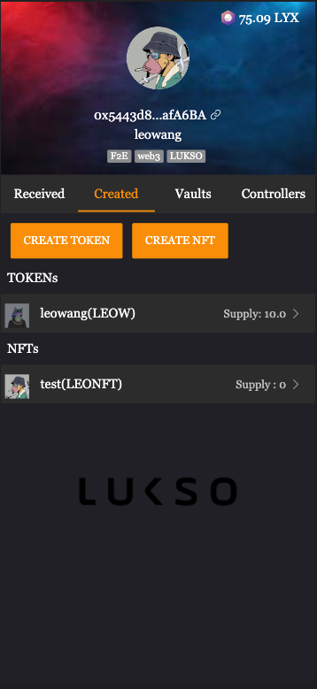
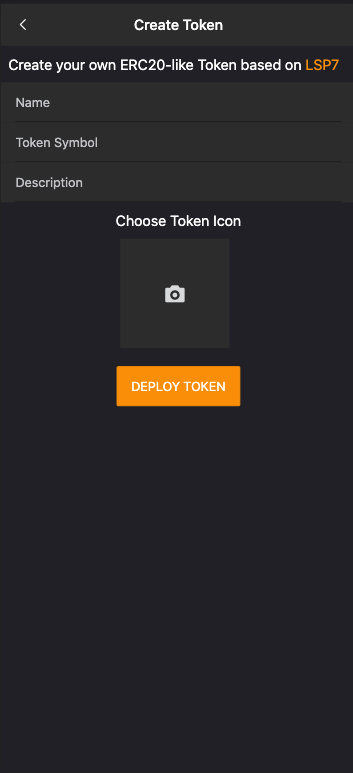
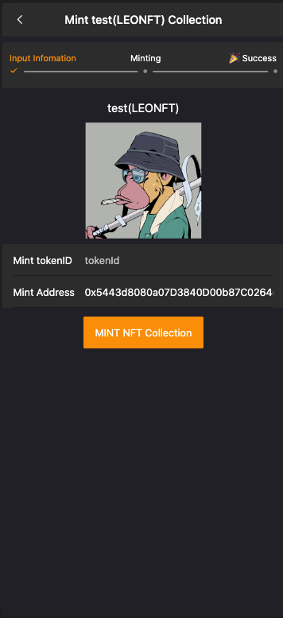
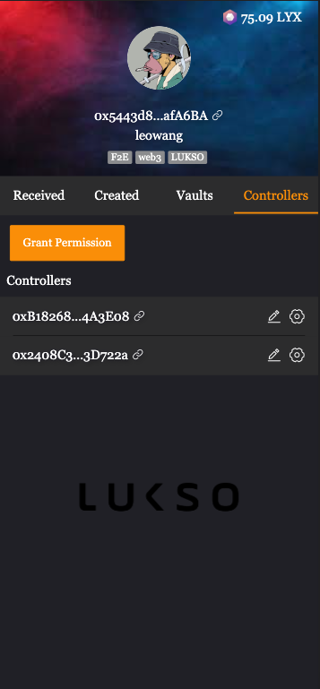
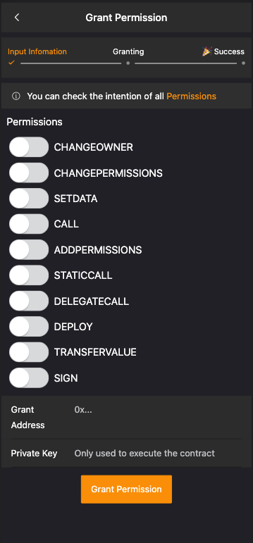
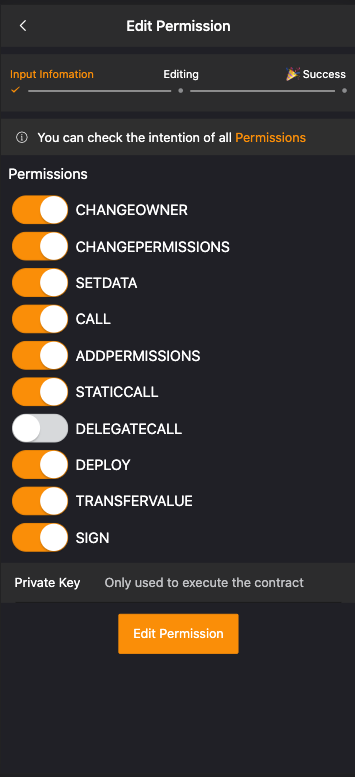

# Project Name

Ieyasu

# Project description
[Ieyasu](https://en.wikipedia.org/wiki/Tokugawa_Ieyasu) unified the Japanese Warring States Period.
Take this name is expected to LUKSO able to dominate in various chains today.

Ieyasu is a wallet can create, mint, transfer LSP7/LSP8 tokens, also provide vault for users to separate/transfer assets to protect user assets.

Ieyasu also can grant permissions to 3rd party addresses to enable them to interact with our Universal Profile or use vault to restrict different addresses (protocols, other devices, etc..) to execute and set data on it instead of doing it directly on the Universal Profile.

- support PC and Mobile,  beautiful UI facilitates user operation.
- support UP extension and other EOA wallet to operation.


# Project run
```
yarn install 
yarn serve
```

# Project requirements
 - Node v16.14.0
# Project Code

Repo - [https://github.com/LeoWangJ/Ieyasu](https://github.com/LeoWangJ/Ieyasu)

# Working App

Website - [https://leyasu.netlify.app](https://leyasu.netlify.app)

# Demo Video

Youtube - Universal Profile Tools - Token & NFT Wallet With Vault Manager(At present, every transaction is waiting, I can't record Demo videos ) 


# Demo by Picture 
- Show received assets  



- Find legacy assets  


- Transfer LSP7/LSP8 assets  



- Ttransfer lyx  



- Show created assets  



- Create LSP7/LSP8 token   



- Mint LSP7/LSP8 token   



- Show created vaults   


 You can switch checked to change owner or vaults to see received / transfer assets 

- Create vault  


- Show created controllers   



- Grant permission  



- Edit permission  



- Restrict addresses to vaults  


# Team
[leowang](https://github.com/LeoWangJ)
# Contact Info

- Discord ID - leoJ#5012
- Email ID - [rfv7855659@gmail.com](mailto:rfv7855659@gmail.com)
- Gitcoin - [leowangj](https://gitcoin.co/leowangj)
